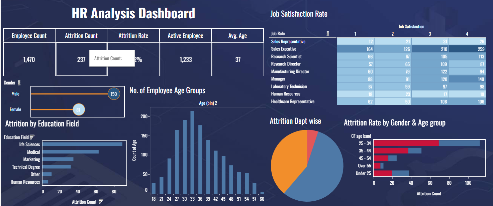

# HR Analytics Dashboard

## Project Overview
This project involves the development of an interactive HR Analytics Dashboard using **Tableau**. The dashboard provides key insights into workforce metrics such as employee count, attrition rate, job satisfaction, and demographic analysis. It enables HR teams to make data-driven decisions and optimize workforce strategies.

## Features
- **Key Performance Indicators (KPIs):**
  - Total Employee Count, Attrition Count, Attrition Rate, Active Employees, and Average Age.
- **Attrition Analysis:**
  - Attrition trends by gender, age groups, education fields, and departments.
- **Job Satisfaction Insights:**
  - Heatmap showing job satisfaction rates across roles.
- **Demographics:**
  - Gender distribution and age group segmentation.
- **Interactive Visualizations:**
  - Filterable and drillable visualizations for in-depth analysis.

## Dashboard Preview

## Files in This Repository
- **`HR_Analytics_Dashboard.twbx`**: The Tableau Packaged Workbook containing the dashboard and data.
- **`sample_data.csv`**: A sample dataset used in the project (if applicable).
- **`dashboard_screenshot.png`**: A preview of the dashboard.
- **`README.md`**: Documentation for this project.

## How to Use
1. Download the `HR_Analytics_Dashboard.twbx` file.
2. Open the file in **Tableau Desktop** or **Tableau Reader**.
3. Interact with the dashboard by exploring filters and visualizations.

## Key Insights
- **Attrition Patterns:** 
  - Identified high attrition rates in specific age groups and departments.
  - Correlated job satisfaction levels with employee retention.
- **Demographic Insights:**
  - Highlighted diversity gaps in gender and education fields.
- **Workforce Metrics:** 
  - Provided actionable KPIs for workforce planning.

## Tools and Skills Used
- **Tools:** Tableau, CSV data processing.
- **Skills:** Data visualization, storytelling, trend analysis, workforce analytics.

## Contact
For questions or collaboration opportunities, feel free to contact me via:
- **Email:** [Your Email Address]
- **LinkedIn:** [Your LinkedIn Profile Link]

---

Feel free to update the contact information and preview image file as needed! Let me know if you need additional sections or modifications.
